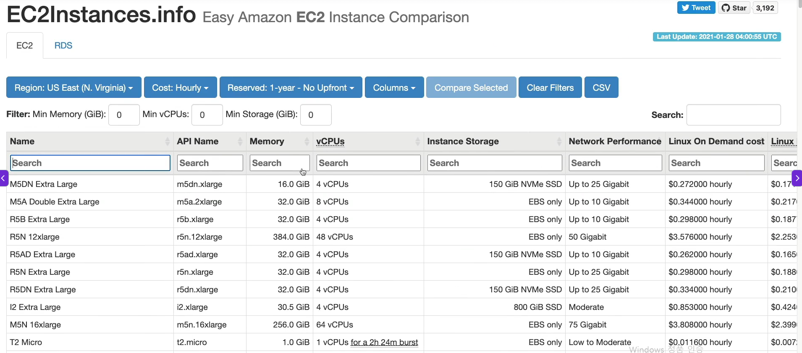

## 33. Create an EC2 Instance with EC2 User Data to have a Website Hands On
EC2 - Instances - Launch instances

Create Key Pair
- .pem : window10 이상 
- .ppk : window10 미만 선택

## 34. Create an EC2 Instance with EC2 User Data to have a Webstie Hands on
instance를 재실행할때마다 Public IPv4 address는 바뀌고
Private IPv4 addresses 는 고정이다.
http로 생성했으면 https로는 못들어간다.

## EC2 Instance Types Basics
7개 종류의 인스턴스가 있음

1. General Purpose
- Greate for a diversity of workloads such as web servers or code repositories
- Balance between
  - Compute
  - Memory
  - Networking
- In the course, we will be using the t2.micro which is a General Purpose EC2 instance

2. Compute Optimized
- Greate for compute-intensive tasks that require high performance processors
  - Batch processing workloads
  - Media transcoding
  - High performance web servers
  - High performance computing (HPC)
  - Scientific modeling & machine learning
  - Dedicated gaming servers

3. Memory Optimized 
- Fast performance for workloads that process large data sets in memory
- Use cases 
  - High performance, relational/non-relational databases
  - Distribute web scale cache stores (ex.ElastiCache = 자주 쓰는 데이터를 잠깐 복사해두는 초고속 저장소)
  - In-memory databases optimized for BI (business intelligence)
  - Applications performing real-time processing of big unstructured data

4. Storage Optimized
- Greate for storage-intensive tasks that require high, sequential read and write access to large data seets on local storage
- Use cases
  - High frequency online transaction processing(OLTP)systems
  - Relational & NoSQL databases
  - Cache for in-memory databases (ex.Redis)
  - Distribured file systmes

ec2instances.info : 모든 ec2인스턴스를 비교할 수 있는 사이트.

## Security Groups & Classic Ports Overview
- Security groups are acting as a "firewall" on EC2 instances
- They regulate 
  - Access to Ports
  - Authorised IP ranges - IPv4 and IPv6
  - Control of inbound network (from other to the instance)
  - Control of outbound network (from the instance to other)

### Securiy Groups Good to know
- Can be attached to multiple instances
- Locked down to a region / VPC combination
- Does live "outside" the EC2 - if traffic is blocked the EC2 instance won't see it
- It's good to maintain one separate secutiy group for SSH access
(SSH처럼 민감한 관리용 접근은 별도의 Security Group으로 분리해서 관리하는 것이 좋은 운영 방식이다)
+요즘 AWS에서는 가능하면 22번 SSH 포트 자체를 열지 않고 AWS Systems Manager Session Manager를 사용하는 방법도 많이 써. 그러면 22 inbound 규칙이 아예 필요 없어서 더 안전해.
- If your application is not accessible(time out), then it's a security group issue
- If your application gives a "connection refused" error, then it's an application error or it's not launched
- All inbound traffic is blocked by default
- All outbound traffic is authorised by default

### Classic Ports to know
- 22 : SSH (Secure Shell) - log into a Linux instance
- 21 = FTP (File Tranasfer Protocol) - upload files into a file share
- 22 = SFTP (Secure File Transfer Protocol) - upload files using SSH
- 80 = HTTP - access unsecured websites
- 443 = HTTPS - access secured websites
- 3389 = RDP (Remote Desktop Protocol) - log into a Windows instance

## 37. SSH Overview

SSH란?
다른 컴퓨터/서버에 원격으로 접속해서 명령어를 실행하는 방식
특히 EC2에서는 Linux 서버에 접속할 때 거의 기본처럼 사용
ex) ssh -i my-key.pem ec2-user@12.34.56.78

pem은 security키 인데, instance를 만들 때 security key를 추가하는 란이 있음.
이 key는 처음 생성할 때 한 번만 저장할 수 있으며 다시 다운 불가함.

만약 instance에 key가 하나만 설정되어있고, 그 key를 잃어버렸으면 instance를 다시 만들어야하고
기존 키로 접속할 수 있으면, 접속 후 key를 추가할 수 있음

원격환경 나가는 keyword : exit

## 42. EC2 Instance Connect
Insance - Connect

- EC Instance Connect
: 웹으로 들어감. 접속 시 임시 SSH키를 생성해서 접속해주기 때문에 기존 SSH키 필요없음
따라서 ssh기본포트인 22가 열려있지 않으면 웹 접속 불가능